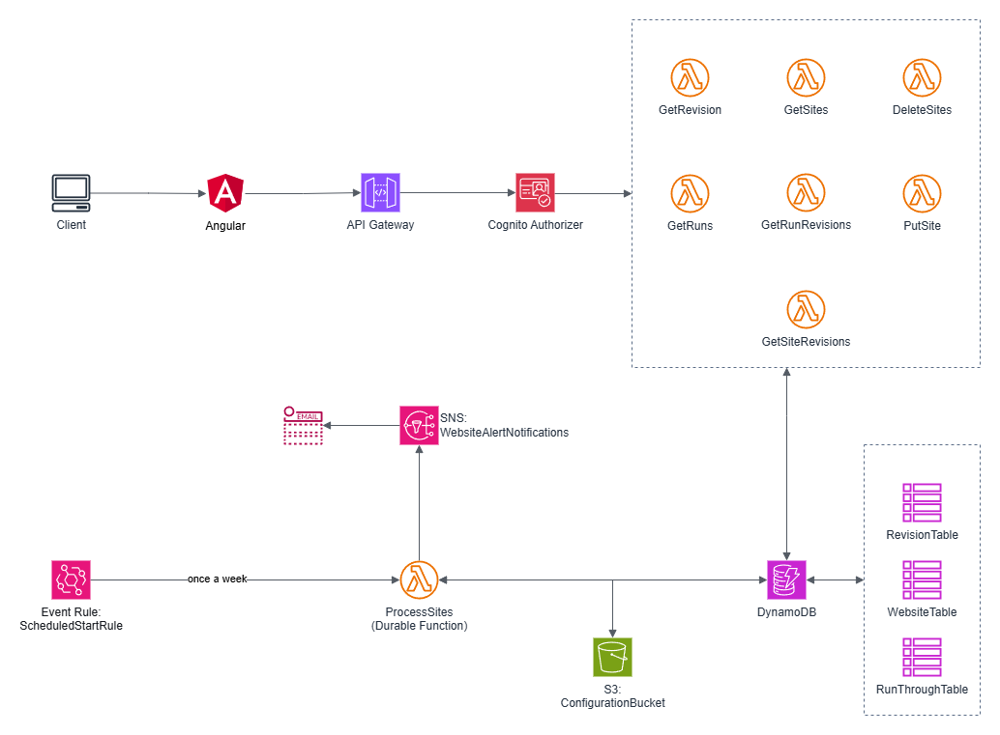

# Website Alerter Tool
A project that scrap websites and alerts the user of changes in those websites 

## Purpose
There are a few websites out there that I was interested in watching for updates. Originally, I looked for the usual ways of watching them for changes (social media, RSS, Google Alerts, etc.), but none of them really fit. I also looked into a variety of online tools that already existed and there didn't seem to be any that fulfilled my requirements: pinging the websites on a weekly basis, giving me a list of changes, and most importantly affordable. So I decided to make my own!

## Stack
Here's how it works!

The stack has two parts:

1. **The frontend and API**: Shows the user the results of a website scrape, add and remove sites for scraping, and view a unified diff easily if any changes were detected.
2. **The weekly scraping process**: Using [AWS Step Functions](https://docs.aws.amazon.com/step-functions/latest/dg/welcome.html) a weekly process is kicked off to queue the user's websites and check them for changes.

## Code 
The [Angular project (frontend)](frontend), [CDK project (backend)](backend), and [Shared library](shared) are stored in separate folders, refer to them for more details on their structure.
