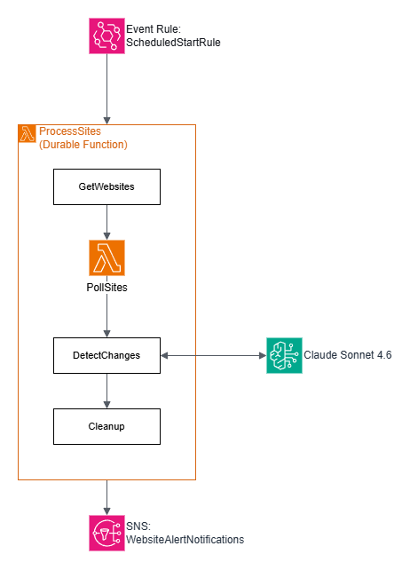

# Website Alerter Tool Backend
This project contains all the AWS components and code required to get the alerter up and running. This includes the website's API and the scraping step functions.

## Description
Since one of my requirements for this project was affordability, I decided to make the entire backend serverless on the [AWS CDK framework](https://aws.amazon.com/cdk/). I've used infrastructure as code frameworks before, and I'm very familiar with CloudFormation, but I had never used the CDK before. So I decided to challenge myself to learn it.

The first challenge was that there were several SPA websites I was looking at, so doing a simple HTML scrape would not work. The best solution I found was to use a headless browser to scrape the site and run the JavaScript long enough to get a good enough render. After some researching, I found [Puppeteer](https://pptr.dev/) seemed to be the best suited for this.

The main problem was that Puppeteer isn't really designed to run in a serverless lambda function: It has to download Chrome/Chromium or work with an already downloaded version of it. There are a few libraries out there that do this like [chrome-aws-lambda](https://github.com/alixaxel/chrome-aws-lambda) and [@sparticuz/chromium](https://github.com/Sparticuz/chromium). Unfortunately, chrome-aws-lambda doesn't seem to be supported anymore and @sparticuz/chromium works, but I had a few concerns (future support and getting it into my TypeScript builds). Also, I was trying to challenge myself! So I decided to go with a [Lambda container image](https://docs.aws.amazon.com/lambda/latest/dg/images-create.html) that had no reliance on external Puppeteer libraries.

The project builds a Node.js 20 Docker container that has Chromium and it's dependencies already installed. Puppeteer can now run and scrape the sites and pass off the data to other Lambda functions in the stack.

## Stack
There are two parts of the backend the API and the Step Functions, they're documented below:

### API (src/functions/api)
The API supports the [Angular website](../frontend) and allows it to communicate with a series of lambda functions to add/edit sites and report on changes to those sites.

- [auth.ts](src/functions/api/auth.ts) - custom authorizer to authenticate a user using JWT.
- [login.ts](src/functions/api/login.ts) - login a user and return a JWT for them to use on future requests. This will end up being a Docker image to support the JWT authentication library.
- [delete-sites.ts](src/functions/api/delete-sites.ts) - delete a site or sites from the database.
- [get-revision.ts](src/functions/api/get-revision.ts) - get a site revision for display to the user.
- [get-run-revisions.ts](src/functions/api/get-run-revisions.ts) - get all the revisions in a run.
- [get-runs.ts](src/functions/api/get-runs.ts) - get all the runs currently in the database.
- [get-site-revisions.ts](src/functions/api/get-site-revisions.ts) - get all the revisions for a specific site.
- [get-sites.ts](src/functions/api/get-sites.ts) - get all the sites currently in the database.
- [put-site.ts](src/functions/api/put-site.ts) - add or edit a site in the database.

### Step Functions (src/functions/process)
The step functions are queued off once a week by an EventBridge rule.

Here's a description of the flow:

1. An EventBridge rule triggers the lambda function [scheduled-start.ts](src/functions/process/scheduled-start.ts) once every 7 days.
2. [scheduled-start.ts](src/functions/process/scheduled-start.ts) creates a new run through in the RunThroughTable and returns each website from the database that needs to be scrapped.
3. [process-site.ts](src/functions/process/process-site.ts) will one-by-one go through each site and scrape it. It will do this by starting up a Puppeteer instance, polling the requested website, and saving the HTML to S3. Finally, it will return whether the polling was successful (sometimes it can fail if the site is down or the CSS selector doesn't work).
4. [detect-changes.ts](src/functions/process/detect-changes.ts) checks to see if sites that were polled have changed. It compares the downloaded HTML to the previous week's scrape. If there is a change, it will generate a unified diff to S3. Finally, it updates the database with whether the two versions have changed.
5. Finally, after all the sites are polled and checked [scheduled-end.ts](src/functions/process/scheduled-end.ts) will parse all the changes detected and send an email via SNS to the user.

# Building
Here are the steps for building for local development and production.

## Prerequisites
- Node.js 20+
- Docker
- [CDK CLI](https://docs.aws.amazon.com/cdk/v2/guide/cli.html)

## Instructions

1. `npm run build` - build and copy Docker functions and dependencies to a build folder.
2. `cdk deploy --parameters notificationEmail=my@email.com` - replace "my@email.com" with the email address you want the notifications of changes to go to.
3. Create a 64 character JWT secret and store it in a file called "jwt.key" and place it in the root of the newly created S3 bucket.
4. Build the [frontend](../frontend) and release it.

## Configuration Options
The following are parameters that can be passed to `cdk deploy` to customize the configuration of the stack:

- `enableSchedule` - Enable the EventBridge rule to queue the sites once a week, by default the rule is **off**.
- `notificationEmail` - The email to get notifications of finished runs
- `numRunsAllowed` - maximum number of runs to keep in the database and S3, defaults to 5.

## Local Development
Refer to guide [here](local-dev.md) for local development instructions.
