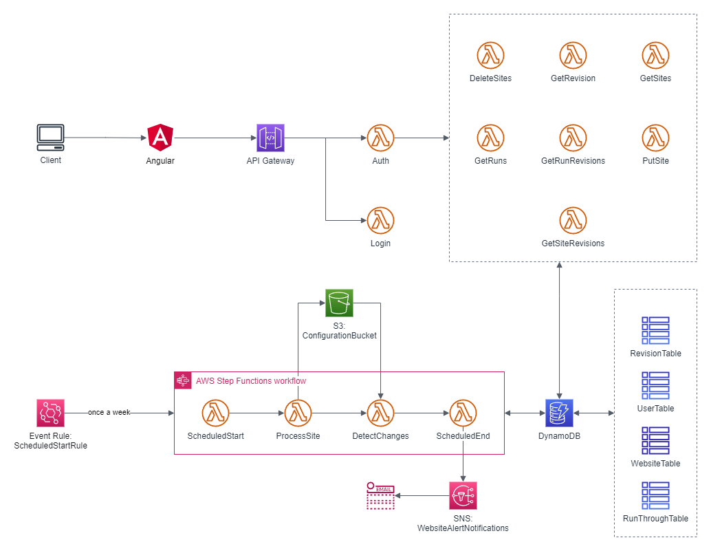

# Website Alerter Tool

An Amazon CDK project that sets up a variety of Lambda functions that will scrape a series of websites to see if there are changes. The whole stack runs on a schedule.

## Purpose
There are a few websites out there that I was interested in watching for updates. Originally, I looked for the usual ways of watching them for changes (social media, RSS, Google Alerts, etc.), but none of them really fit. I also looked into a variety of online tools that already existed and there didn't seem to be any that fulfilled my requirements: pinging the websites on a weekly basis, giving me a list of changes, and most importantly affordable. So I decided to make my own!

Since one of my requirements was affordability, I decided to make the entire project serverless on the Amazon CDK framework. I've used infrastructure as code frameworks before, and I'm very familiar with CloudFormation. I had never used the CDK before though, so I decided to challenge myself to learn it.

The first challenge was that there were several SPA websites I was looking at and doing a simple HTML scrape would not work. The best solution for this was to use a headless browser framework to scrape the site and run the JavaScript on the site long enough to get a good enough render. Researching frameworks out there, [Puppeteer](https://pptr.dev/) seemed to be the best suited for this.

The main problem was that Puppeteer isn't really designed to run in a serverless lambda function: It has to download Chrome/Chromium or work with an already downloaded version of it. There are a few libraries out there that do this ([chrome-aws-lambda](https://github.com/alixaxel/chrome-aws-lambda) and [@sparticuz/chromium](https://github.com/Sparticuz/chromium)), unfortunately chrome-aws-lambda doesn't seem to be supported anymore and @sparticuz/chromium works, but I was concerned about future support and packaging it into my TypeScript builds. Also, I was trying to challenge myself! So I decided to go with a Lambda container image that had no reliance on external Puppeteer libraries.

The project builds a Node.js 18 Docker container that has Chromium already installed ([Lambda container images](https://docs.aws.amazon.com/lambda/latest/dg/images-create.html)). Puppeteer can now run and scrape the sites and pass off the data to other Lambda functions in the stack.

## Stack
Here's how it works!

The whole stack runs in the following order:

1. An EventBridge rule triggers the lambda function [scheduled-start.ts](src/functions/scheduled-start.ts) once every 7 days.
2. [scheduled-start.ts](src/functions/scheduled-start.ts) queues each website in the config.json (located in S3) into the WebsiteQueue SQS. It also makes sure that all sites and a new run is added to their respective DynamoDB tables. After which, it will queue an end event to the EndQueue SQS which has a 10 minute delay.
3. [process-site.ts](src/functions/process-site.ts) picks up the events from the SQS queue. It will then start up a puppeteer instance and poll the requested website and save the HTML to S3. Finally, it will put a change check event into the ChangeQueue SQS.
4. [detect-changes.ts](src/functions/detect-changes.ts) picks up the change check event from the SQS queue. It compares the downloaded html to the previous week's scrape. If there is a change, it will generate a unified diff to S3. Finally, it updates the database with whether the two versions have changed.
5. Finally, after the 10 minute delay [scheduled-end.ts](src/functions/scheduled-end.ts) will parse all the changes detected and send an email via SNS with all the changes detected.

# Building
Here are the steps for building for local development and production.

## Prerequisites
- Node.js 18+
- Docker
- [CDK CLI](https://docs.aws.amazon.com/cdk/v2/guide/cli.html)

## Instructions

1. `npm run build` - build [process-site.ts](src/functions/process-site.ts) and copy Docker dependencies to a build folder.
2. `cdk deploy --parameters notificationEmail=my@email.com` - replace "my@email.com" with the email address you want the notifications of changes to go to.
3. Customize a `config.json` file and put it in the newly created S3 bucket the stack made. There is a sample of what a `config.json` should look like [config.json](sample/config.json) here.
4. Start the flow by waiting for the EventBridge rule or testing the ScheduledStart lambda function.

## Local Development
Refer to guide [here](local-dev.md) for local development instructions.

